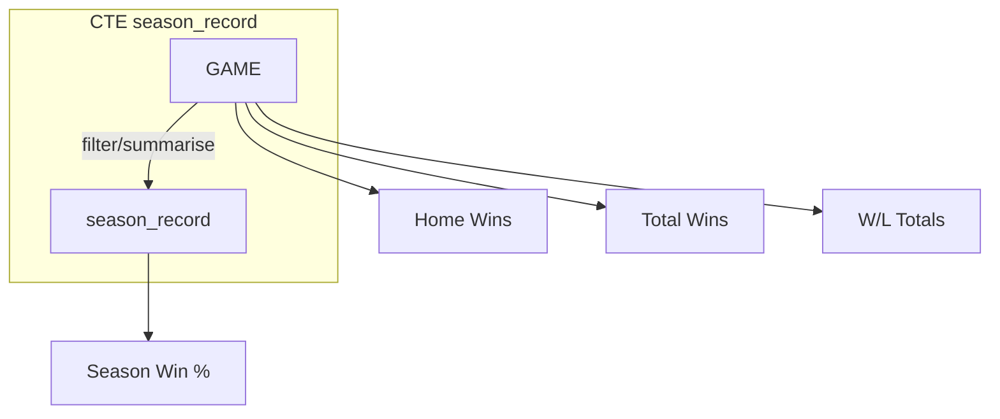

# NBA Winners and Losers– Oracle SQL Developer Edition

A mini‑project that answers three classic basketball questions using pure SQL and an open Kaggle dataset.

| Question                                                                 | Quick answer provided by this repo                                |
| ------------------------------------------------------------------------ | ----------------------------------------------------------------- |
| **1. Lifetime record** – How many games has each franchise won and lost? | `queries/game_stats_queries.sql` → section **4**                  |
| **2. Best single‑season record**                                         | `queries/game_stats_queries.sql` → section **5** (order **DESC**) |
| **3. Worst single‑season record**                                        | same query, ordered **ASC**                                       |

---

## 1  Dataset

* **Source**: [Kaggle – NBA Games History](kaggle‑url‑here)
* **Original form**: \~20 CSV files (games, teams, players, etc.)
* **Table used here**: **`GAME`** – one row per game with results for both teams.

| Column           | Example            | Notes                |
| ---------------- | ------------------ | -------------------- |
| `GAME_DATE`      | 1949‑11‑02         | DATE                 |
| `TEAM_NAME_HOME` | "Detroit Pistons"  |                      |
| `TEAM_NAME_AWAY` | "Boston Celtics"   |                      |
| `WL_HOME`        | `"W"` / `"L"`      | Result for home team |
| `WL_AWAY`        | `"L"` / `"W"`      | Result for away team |
| `SEASON_ID`      | `"S2019"`          | Kaggle’s season code |
| `SEASON_TYPE`    | `"Regular Season"` | filters out playoffs |

## 2  Import workflow

1. **Download CSVs** from Kaggle.
2. **Oracle SQL Developer ▶ Tools ▶ Import Data** → target table `GAME`.
3. Repeat for each CSV or use the wizard’s batch mode.

*(On a fresh Oracle 21c XE install the whole import fits comfortably in the default USERS tablespace.)*

## 3  Analysis approach

> 100 % **ad‑hoc SQL** – no stored procedures, no BI tool, just worksheets.



* **Common Table Expression (`season_record`)**: flattens home & away results into one union for per‑season stats.
* All other queries read the base `GAME` table directly or reuse the CTE in‑memory.

## 4  Running the queries

```bash
-- open a worksheet connected to your PDB/schema
@queries/game_stats_queries.sql
```

SQL Developer displays each SELECT in a separate grid.

### Getting the "best" or "worst" season quickly

```sql
-- Best season (highest win‑pct)
WITH ...  -- identical CTE
ORDER BY win_pct DESC FETCH FIRST 1 ROW ONLY;

-- Worst season (lowest win‑pct)
ORDER BY win_pct ASC  FETCH FIRST 1 ROW ONLY;
```

## 5  Results snapshot *(as of dataset download)*

| Team               | All‑time Wins | All‑time Losses |
| ------------------ | ------------: | --------------: |
| Boston Celtics     |          3606 |            2469 |
| Los Angeles Lakers |          3476 |            2595 |
| …                  |             … |               … |

> *Best single season*: **Golden State Warriors 2016 – 73‑9 (0.890)**
> *Worst single season*: **Charlotte Bobcats 2012 – 7‑59 (0.106)**

*(Numbers may differ if Kaggle updates the dataset.)*

## 6  Folder structure

```
.
├── README.md                ← you are here
├── queries/
│   └── game_stats_queries.sql
└── data/                    ← raw CSVs from Kaggle (ignored by Git)
```

## 7  Next steps / ideas

* Automate CSV → Oracle load with SQL\*Loader or external tables.
* Create materialised views for faster season summaries.
* Visualise results in a lightweight dashboard (e.g., Apache Superset or a simple Python notebook).

---

© 2025 Your Name – MIT License
